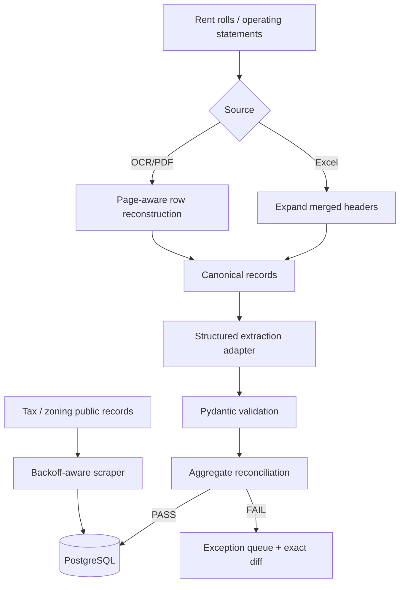

# CRE Document Data Pipeline

Portfolio-safe, runnable reference implementation for ingesting messy commercial real-estate documents and public records into validated relational data. All included fixtures are synthetic.

## Why this repo exists

It demonstrates the engineering claims behind a Data Engineering Analyst profile without publishing client data or pretending cloud/LLM calls happened during the demo. The core is deterministic and testable offline; AWS Textract, Azure Document Intelligence, Tesseract, Anthropic, or OpenAI can be attached at explicit adapter boundaries.

## Demonstrated capabilities

- Python ingestion and validation
- merged/multi-row Excel header normalization with `openpyxl`
- multi-page OCR continuation reconstruction
- strict Pydantic contracts
- mathematical rent/square-foot reconciliation
- exception quarantine with exact diffs
- PostgreSQL/SQLAlchemy schema boundary
- public assessment parsing and rate-limit-aware HTTP backoff
- provider-neutral structured LLM extraction interface
- Dockerized PostgreSQL and GitHub Actions CI

## Architecture



## Quick start

```bash
python -m venv .venv
source .venv/bin/activate  # Windows: .venv\Scripts\activate
pip install -e ".[dev]"
pytest -q
```

Optional PostgreSQL:

```bash
docker compose up -d postgres
```

## What broke and how this repo models the fix

### 1. Merged Excel headers

Broker/operating-statement workbooks can use merged parent banners over month-level columns. The normalizer copies the merged anchor across the range before unmerging, propagates hierarchical labels, and flattens them into stable field names. This models the real failure precisely: sparse merged headers can cause a naive parser to map columns incorrectly.

### 2. Page-split OCR rows

A tenant record can continue onto the next scanned page without repeating its primary identifier. The row stitcher retains page metadata and only merges a keyless continuation when a page transition occurs, filling missing fields without overwriting existing source values.

### 3. Plausible but incorrect extraction

Schema-valid data can still be financially wrong. The reconciliation layer independently sums extracted square footage and rent/reimbursements and compares them with stated document totals. A mismatch blocks persistence and writes an exact diff to the exception queue.

## LLM / OCR integrations

`llm_adapter.py` intentionally defines a provider-neutral structured extraction contract. A production deployment can implement it with Anthropic or OpenAI structured outputs. Likewise, Textract/Azure/Tesseract can feed normalized OCR rows. Credentials are never required for tests.

This distinction is intentional: the repository demonstrates architecture and failure handling without fabricating paid API execution or proprietary production artifacts.

## Public-record enrichment

`public_records.py` includes a parser for synthetic tax/assessment HTML plus an async HTTP fetcher with bounded exponential backoff for 429 and transient 5xx responses. Real municipal portals require site-specific selectors and compliance with their terms and robots/rate-limit policies.

## Tests

The suite proves:

- merged headers expand and flatten deterministically;
- a cross-page continuation row is reconstructed;
- reconciled batches pass;
- mismatched totals are quarantined;
- synthetic assessment HTML becomes a typed parcel record.

## Scope / honesty boundary

This is a **portfolio reference implementation using synthetic data**. It is suitable for demonstrating how the system is designed and tested.

## Author

Lokeshprasanth Gadesula
