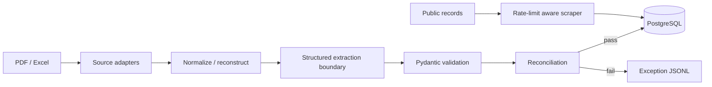

# Architecture

The system separates source-specific extraction from validation and persistence. Excel inputs are normalized before DataFrame construction. OCR/PDF adapters retain page/geometry metadata so page-boundary continuations can be reconstructed. Provider-specific LLM extraction sits behind a structured extractor boundary. Pydantic validates records, then aggregate reconciliation blocks persistence on mismatches. Public-record enrichment uses bounded exponential backoff.

